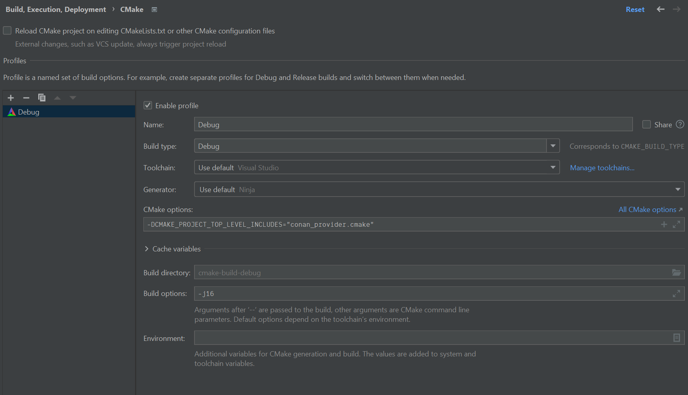

# Minimal repro repository with Conan problem with backslashes

Legend:
```
[REDACTED FOLDER NAME BEGINNING WITH D] = G:\DSomething\(...)
```

CLion CMake profile:


Log: 
```
"C:\Program Files\JetBrains\CLion 2023.2.2\bin\cmake\win\x64\bin\cmake.exe" -DCMAKE_BUILD_TYPE=Debug "-DCMAKE_MAKE_PROGRAM=C:/Program Files/JetBrains/CLion 2023.2.2/bin/ninja/win/x64/ninja.exe" -DCMAKE_PROJECT_TOP_LEVEL_INCLUDES=conan_provider.cmake -G Ninja -S G:\[REDACTED FOLDER NAME BEGINNING WITH D]\projects\conan-cmake-backslash-generator-problem -B G:\[REDACTED FOLDER NAME BEGINNING WITH D]\projects\conan-cmake-backslash-generator-problem\cmake-build-debug
-- The C compiler identification is MSVC 19.37.32825.0
-- The CXX compiler identification is MSVC 19.37.32825.0
-- Detecting C compiler ABI info
-- Detecting C compiler ABI info - done
-- Check for working C compiler: C:/Program Files/Microsoft Visual Studio/2022/Community/VC/Tools/MSVC/14.37.32822/bin/Hostx64/x64/cl.exe - skipped
-- Detecting C compile features
-- Detecting C compile features - done
-- Detecting CXX compiler ABI info
-- Detecting CXX compiler ABI info - done
-- Check for working CXX compiler: C:/Program Files/Microsoft Visual Studio/2022/Community/VC/Tools/MSVC/14.37.32822/bin/Hostx64/x64/cl.exe - skipped
-- Detecting CXX compile features
-- Detecting CXX compile features - done
-- CMake-Conan: first find_package() found. Installing dependencies with Conan
-- CMake-Conan: Checking if a default profile exists
C:\Users\[REDACTED]\.conan2\profiles\default
-- CMake-Conan: cmake_system_name=Windows
-- CMake-Conan: cmake_system_processor=x86_64
-- CMake-Conan: CMake compiler=MSVC
-- CMake-Conan: CMake compiler version=19.37.32825.0
-- CMake-Conan: [settings] compiler=msvc
-- CMake-Conan: [settings] compiler.version=193
-- CMake-Conan: Creating profile G:/[REDACTED FOLDER NAME BEGINNING WITH D]/projects/conan-cmake-backslash-generator-problem/cmake-build-debug/conan_host_profile
-- CMake-Conan: Profile: 
[settings]
arch=x86_64
os=Windows
compiler=msvc
compiler.version=193
compiler.cppstd=20
build_type=Debug
[conf]
tools.cmake.cmaketoolchain:generator=Ninja
tools.build:compiler_executables={"c":"C:/Program Files/Microsoft Visual Studio/2022/Community/VC/Tools/MSVC/14.37.32822/bin/Hostx64/x64/cl.exe","cpp":"C:/Program Files/Microsoft Visual Studio/2022/Community/VC/Tools/MSVC/14.37.32822/bin/Hostx64/x64/cl.exe"}

-- CMake-Conan: Installing single configuration Debug
-- CMake-Conan: conan install G:/[REDACTED FOLDER NAME BEGINNING WITH D]/projects/conan-cmake-backslash-generator-problem -of=G:/[REDACTED FOLDER NAME BEGINNING WITH D]/projects/conan-cmake-backslash-generator-problem/cmake-build-debug/conan --profile:host=default;--profile:host=G:/[REDACTED FOLDER NAME BEGINNING WITH D]/projects/conan-cmake-backslash-generator-problem/cmake-build-debug/conan_host_profile;--profile:build=default;--build=missing;-g;CMakeDeps

======== Input profiles ========
Profile host:
[settings]
arch=x86_64
build_type=Debug
compiler=msvc
compiler.cppstd=20
compiler.runtime=dynamic
compiler.runtime_type=Debug
compiler.version=193
os=Windows
[conf]
tools.cmake.cmaketoolchain:generator=Ninja
tools.build:compiler_executables={'c': 'C:/Program Files/Microsoft Visual Studio/2022/Community/VC/Tools/MSVC/14.37.32822/bin/Hostx64/x64/cl.exe', 'cpp': 'C:/Program Files/Microsoft Visual Studio/2022/Community/VC/Tools/MSVC/14.37.32822/bin/Hostx64/x64/cl.exe'}

Profile build:
[settings]
arch=x86_64
build_type=Release
compiler=msvc
compiler.cppstd=14
compiler.runtime=dynamic
compiler.runtime_type=Release
compiler.version=193
os=Windows


======== Computing dependency graph ========
Graph root
    conanfile.py: G:/[REDACTED FOLDER NAME BEGINNING WITH D]/projects/conan-cmake-backslash-generator-problem\conanfile.py
Requirements
    imgui/1.89.9#f3ef880f1e64558b75b701ea2d4701aa - Cache

======== Computing necessary packages ========
Requirements
    imgui/1.89.9#f3ef880f1e64558b75b701ea2d4701aa:3e9241b8bca8d7d0cd1d864535a2c18a3b684955#eb32ec1e7fad46cf1c90a6b4aeff1158 - Cache

======== Installing packages ========
imgui/1.89.9: Already installed! (1 of 1)
imgui/1.89.9: Appending PATH env var with : C:\Users\[REDACTED]\.conan2\p\b\imgui273bb5af9c6a1\p\bin
WARN: deprecated: Usage of deprecated Conan 1.X features that will be removed in Conan 2.X:
WARN: deprecated:     'env_info' used in: imgui/1.89.9

======== Finalizing install (deploy, generators) ========
conanfile.py: Writing generators to G:\[REDACTED FOLDER NAME BEGINNING WITH D]\projects\conan-cmake-backslash-generator-problem\cmake-build-debug\conan\build\Debug\generators
conanfile.py: Generator 'CMakeDeps' calling 'generate()'
conanfile.py: Calling generate()
conanfile.py: Generators folder: G:\[REDACTED FOLDER NAME BEGINNING WITH D]\projects\conan-cmake-backslash-generator-problem\cmake-build-debug\conan\build\Debug\generators
conanfile.py: CMakeToolchain generated: conan_toolchain.cmake
conanfile.py: Preset 'conan-debug' added to CMakePresets.json. Invoke it manually using 'cmake --preset conan-debug' if using CMake>=3.23
conanfile.py: If your CMake version is not compatible with CMakePresets (<3.23) call cmake like: 'cmake <path> -G Ninja -DCMAKE_TOOLCHAIN_FILE=G:\[REDACTED FOLDER NAME BEGINNING WITH D]\projects\conan-cmake-backslash-generator-problem\cmake-build-debug\conan\build\Debug\generators\conan_toolchain.cmake -DCMAKE_POLICY_DEFAULT_CMP0091=NEW -DCMAKE_BUILD_TYPE=Debug'
conanfile.py: CMakeToolchain generated: CMakePresets.json
conanfile.py: Generating aggregated env files
conanfile.py: Generated aggregated env files: ['conanbuild.bat', 'conanrun.bat']
Install finished successfully
-- CMake-Conan: CONAN_GENERATORS_FOLDER=G:\[REDACTED FOLDER NAME BEGINNING WITH D]\projects\conan-cmake-backslash-generator-problem\cmake-build-debug\conan\build\Debug\generators
-- CMake-Conan: CONANFILE=G:/[REDACTED FOLDER NAME BEGINNING WITH D]/projects/conan-cmake-backslash-generator-problem/conanfile.py
-- Could NOT find Threads (missing: Threads_DIR)
-- Performing Test CMAKE_HAVE_LIBC_PTHREAD
CMake Error at G:/[REDACTED FOLDER NAME BEGINNING WITH D]/projects/conan-cmake-backslash-generator-problem/cmake-build-debug/CMakeFiles/CMakeScratch/TryCompile-3kergz/CMakeLists.txt:2 (set):
  Syntax error in cmake code at

    G:/[REDACTED FOLDER NAME BEGINNING WITH D]/projects/conan-cmake-backslash-generator-problem/cmake-build-debug/CMakeFiles/CMakeScratch/TryCompile-3kergz/CMakeLists.txt:2

  when parsing string

    G:\[REDACTED FOLDER NAME BEGINNING WITH D]\projects\conan-cmake-backslash-generator-problem\cmake-build-debug\conan\build\Debug\generators

  Invalid character escape '\D'.


CMake Error at C:/Program Files/JetBrains/CLion 2023.2.2/bin/cmake/win/x64/share/cmake-3.26/Modules/Internal/CheckSourceCompiles.cmake:101 (try_compile):
  Failed to configure test project build system.
Call Stack (most recent call first):
  C:/Program Files/JetBrains/CLion 2023.2.2/bin/cmake/win/x64/share/cmake-3.26/Modules/CheckCSourceCompiles.cmake:76 (cmake_check_source_compiles)
  C:/Program Files/JetBrains/CLion 2023.2.2/bin/cmake/win/x64/share/cmake-3.26/Modules/FindThreads.cmake:97 (CHECK_C_SOURCE_COMPILES)
  C:/Program Files/JetBrains/CLion 2023.2.2/bin/cmake/win/x64/share/cmake-3.26/Modules/FindThreads.cmake:163 (_threads_check_libc)
  conan_provider.cmake:517 (find_package)
  CMakeLists.txt:6 (find_package)


-- Configuring incomplete, errors occurred!

[Failed to reload]
```